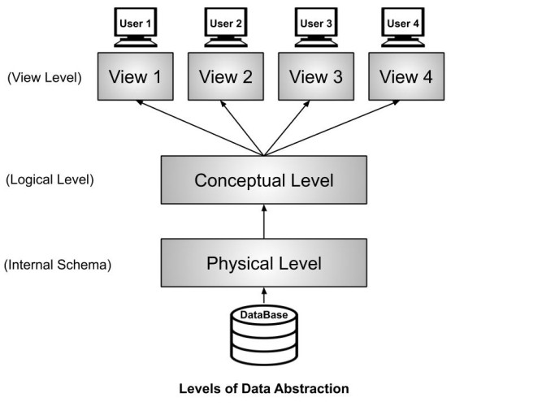

`WAIL-TD` is the abbreviation for **what-am-I-learning-this-week**, and I'm currently learning about Databases from [Mike Carey](https://ics.uci.edu/~mjcarey/index.html).

These are going to be my notes which I can come back to later on.

## Levels of Data Abstraction

The diagram above shows the three levels of data abstraction in database systems:

 

1. **View Level**: What different users see - customized views of the data. For example, an instructor wants to view the total number of students enrolled for his/her course, while a student only sees their own grades and enrolled courses.

2. **Conceptual Level**: In my easy words, conceptual schema is _what is visible to the average user_, they see data stored in tables in case of relational databases and they donot see how exactly they are physically stored across the hardware, what indexes are there etc.

    - Students (sid: string, name: string, login: string, age: integer, gpa: real)
    - Courses (cid: string, cname: string, credits: integer)
    - Enrolled(sid: string, cid: string, gpa: real)

3. **Physical Level**: How the data is actually stored on hardware - the files, indexes, storage structures, and access methods used by the database management system. This includes details like B-trees, hash tables, and disk storage organization.

